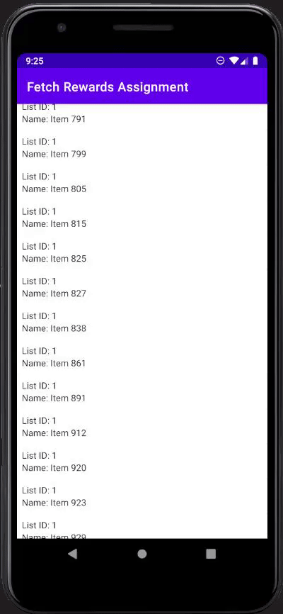

# Fetch-Rewards-Coding-Exercise
My submission for the Fetch Rewards Coding Excercise

Author: Justin Mabutas

## Description
Please write a native Android app in Kotlin or Java that retrieves the data from https://fetch-hiring.s3.amazonaws.com/hiring.json.

Display this list of items to the user based on the following requirements:
* Display all the items grouped by "listId"
* Sort the results first by "listId" then by "name" when displaying.
* Filter out any items where "name" is blank or null.
The final result should be displayed to the user in an easy-to-read list.

## Installation
```
git clone https://github.com/JTMabutas17/Fetch-Rewards-Coding-Exercise.git
```
Run the app in Android Studio.

## Implementation
This project uses Retrofit to get the JSON data and save it to an ArrayList.
The ArrayList is then prepared by filtering out elements with null/empty names, sorting by listId, then sorting the elements of each group by name.
The ArrayList is then displayed in a RecyclerView.

## Demo

